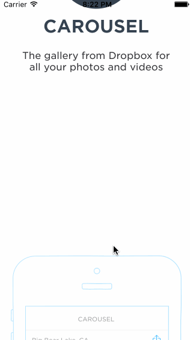

# codepath-carousel

This is an iOS demo prototype simulating parts of the Dropbox Carousel app. "Sign in" with the email 'jason@me.com' and the password 'test'.

Time spent: 6 hours

Completed user stories:

* [x] Static photo tiles on the initial screen
* [ ] Optional: Photo tiles move with scrolling
* Sign In
  * [x] Tapping on email/password reveals the keyboard and shifts the scrollview and Sign In button up.
    * Upon tapping the Sign In button.
      * [x] If the username or password fields are empty, user sees an error alert.
      * [x] If credentials are incorrect, user sees a loading indicator for 2 seconds followed by an error alert.
      * [x] If the credentials are correct, user sees a loading indicator for 2 seconds followed by a transition to the Sign In screens.
  * [x] Optional: When the keyboard is visible, if the user pulls down on the scrollview, it will dismiss the keyboard.
  * [ ] Optional: On appear, scale the form up and fade it in.
* Optional: Create a Dropbox
  * [ ] Optional: Tapping in the form reveals the keyboard and shifts the scrollview and "Create a Dropbox" button up.
  * [ ] Optional: Tapping the Agree to Terms checkbox selects the checkbox.
  * [ ] Optional: Tapping on Terms shows a webview with the terms.
  * [ ] Optional: User is taken to the tutorial screens upon tapping the "Create a Dropbox" button.
* Tutorial Screens
  * [x] User can page between the screens
  * [x] Optional: User can page between the screens with updated dots
  * [x] Optional: Upon reaching the 4th page, hide the dots and show the "Take Carousel for a Spin" button.
* Image Timeline
  * [x] Display a scrollable view of images.
  * [x] User can tap on the conversations button to see the conversations screen (push).
  * [x] User can tap on the profile image to see the settings view (modal from below).
* Conversations
  * [x] User can dismiss the conversations screen
* Settings
  * [x] User can dismiss the settings screen.
  * [x] User can sign out
  * [x] Sign out uses action modal to confirm/cancel
* Optional: Learn more about Carousel
  * [ ] Optional: Show the "Learn more about Carousel" button in the photo timeline.
  * [ ] Optional: Tap the X to dismiss the banner
  * [ ] Optional: Track the 3 events:
    * [ ] View a photo full screen
    * [ ] Swipe left and right
    * [ ] Share a photo
  * [ ] Optional: Upon completion of the events, mark them green.
  * [ ] Optional: When all events are completed, dismiss the banner.

GIF created with [LiceCap](http://www.cockos.com/licecap/).
